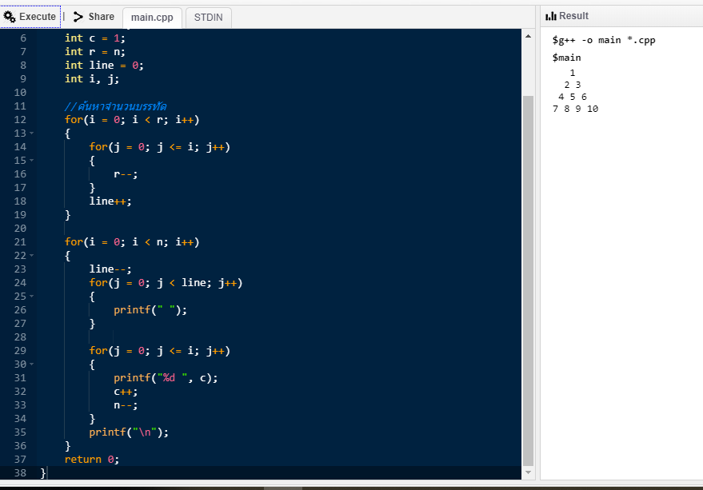
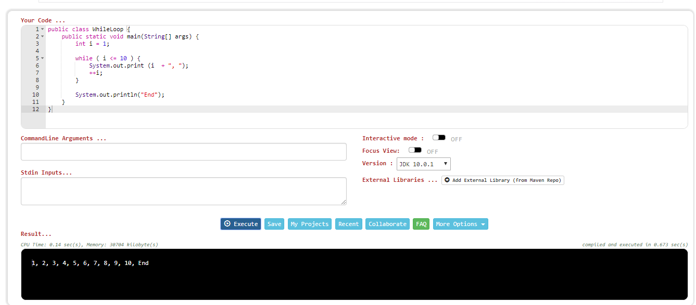

# วันนี้จะมาแนะนำการเขียนโค้ค 1-10 จากภาษาที่ทุกคนรู้จักนะคะ นั้นคือภาษา C,Java และ PHP 
ภาษาแรกคือ 

## ภาษา PHP

[คลิกเพื่อดูโค๊ดภาษา PHP](https://github.com/kanokwanfpp/Code-1-10/blob/master/Code%20PHP) 

- จากภาษาตัวอย่างข้างต้นก็หามาได้จาก Google แต่เอามารวมรวบเพื่อให้ทุกคนได้ศึกษาได้ง่ายขึ้น 

## ภาษา C

[คลิกเพื่อดูโค๊ดภาษา C](https://github.com/kanokwanfpp/Code-1-10/blob/master/Code%20C)

- จากภาษาตัวอย่างข้างต้นก็หามาได้จาก Google แต่เอามารวมรวบเพื่อให้ทุกคนได้ศึกษาได้ง่ายขึ้น 

## ภาษา Java

[คลิกเพื่อดูโค๊ดภาษา Java](https://github.com/kanokwanfpp/Code-1-10/blob/master/Code%20Java)

- จากภาษาตัวอย่างข้างต้นก็หามาได้จาก Google แต่เอามารวมรวบเพื่อให้ทุกคนได้ศึกษาได้ง่ายขึ้น 
